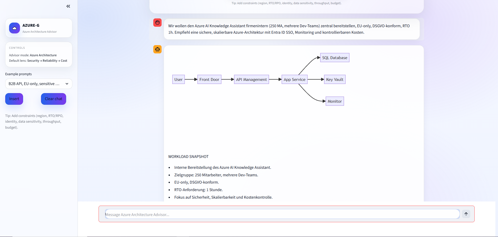
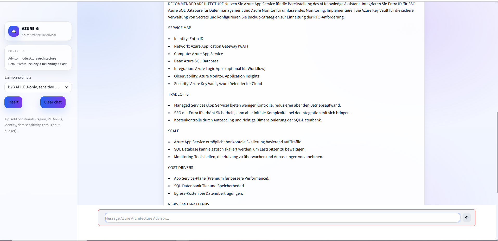
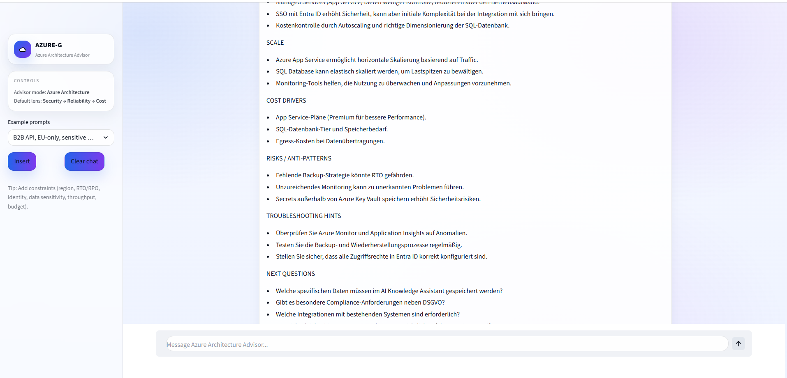
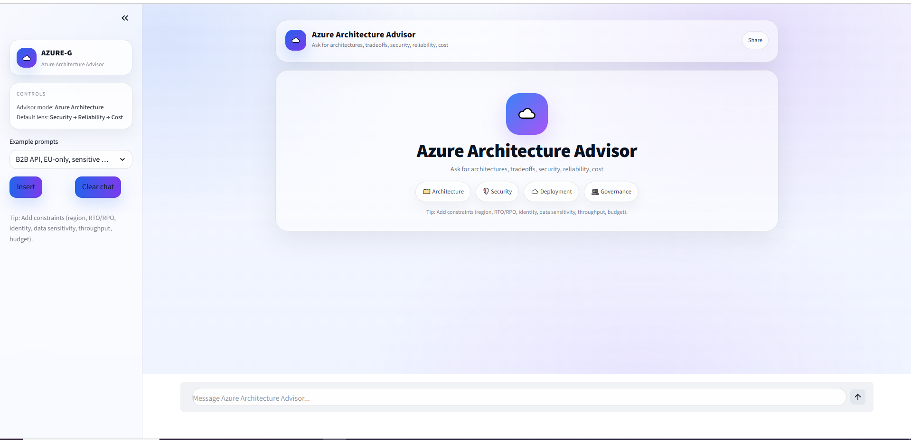
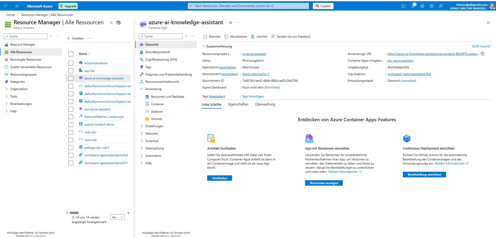

# Azure AI Knowledge Assistant

Ein AI-gestützter Azure Architecture Advisor zur Unterstützung von Cloud Engineers und DevOps-Teams bei Architekturentscheidungen, Deployment-Guidance und Troubleshooting im Azure-Umfeld.

Das Projekt demonstriert praktische Erfahrung in Cloud Engineering, DevOps-Workflows, Containerisierung, Retrieval-Augmented Generation (RAG) sowie automatisierter Generierung visueller Architekturdiagramme mit Fokus auf Azure.

---

## Projektüberblick

Der Azure AI Knowledge Assistant fungiert als interner Cloud-Engineering-Assistent und unterstützt bei:

- Azure Architekturentscheidungen  
- Deployment-Planung und Best Practices  
- Troubleshooting von Cloud-Setups  
- Schnelleren Projektstarts im Azure-Umfeld  
- Kontextbasierter Beratung über eine Knowledge Base (RAG)  
- Automatischer Generierung visueller Architekturdiagramme (Mermaid)

Neben textuellen Empfehlungen erzeugt der Assistant automatisch Architekturdiagramme, die direkt im Interface visualisiert werden.

---

## Visuelle Architektur-Ausgabe

Ein zentrales Feature des Projekts ist die automatische Generierung von Architekturdiagrammen auf Basis der jeweiligen Anforderungen.

Die Diagramme werden dynamisch als Mermaid-Flowcharts erstellt und direkt im UI dargestellt.

### Beispiel: Interne Bereitstellung mit Entra ID und Monitoring







Dieses Feature demonstriert:

- Architekturverständnis im Cloud-Kontext  
- Strukturierte Darstellung technischer Systeme  
- Kombination von LLM-Output mit visualisierten Architekturkonzepten  
- Erweiterte Prompt-Steuerung und Output-Parsing  
- Integration visueller Komponenten in eine Engineering-UI  

---

## Architektur und technische Highlights

- Python-basierte Chatbot-Applikation  
- Streamlit UI  
- Container-ready Architektur (Docker)  
- Azure Deployment vorbereitet (Container Apps / Web App / ACR Workflow)  
- Retrieval Augmented Generation über lokale Knowledge Base  
- Dynamische Mermaid-Diagramm-Generierung  
- Prompt-Separation zur Wartbarkeit (`/prompts`)  
- Modularer Retriever (`retriever.py`)  
- GitHub-basierte CI/CD Integration  

---

## Tech Stack

### Core Technologien

- Python  
- Streamlit  
- OpenAI API  
- Mermaid Diagram Rendering  
- Knowledge Base Retrieval (RAG)  

### Cloud / DevOps Fokus

- Docker Containerisierung  
- Azure Container Registry (ACR)  
- GitHub Actions CI/CD Pipeline  
- Azure Container Apps  
- Azure Monitoring Stack  

---

## Features

### Architekturberatung

- Architektur-Empfehlungen für Azure Workloads  
- Security / Reliability / Cost Trade-offs  
- Deployment Guidance  
- Cloud Best Practices  

### Visuelle Architekturdiagramme

- Automatisch generierte Mermaid-Diagramme  
- Direktes Rendering im UI  
- Strukturierte Systemübersicht  
- Unterstützung bei Architekturentscheidungen  

### Knowledge Base Integration

- Kontextbasierte Antworten über eigene KB (`/kb`)  
- Erweiterbare Dokumentationsbasis  
- RAG-Workflow implementiert  

### DevOps-orientiertes Design

- Container-first Ansatz  
- Environment-basierte Konfiguration  
- CI/CD Deployment vorbereitet  

---

## Repository Struktur

```
.
├── app.py
├── retriever.py
├── kb/
├── prompts/
├── Dockerfile
├── requirements.txt
└── .github/workflows
```

---

## Weitere Screenshots

### UI Übersicht



### Azure Container App Deployment



---

## Technischer Mehrwert

Dieses Projekt demonstriert:

- Architekturdenken im Azure-Kontext  
- Integration von AI in Cloud-Engineering-Workflows  
- Automatisierte Diagramm-Erstellung mittels LLM  
- Containerisierung und Deploymentprozesse  
- CI/CD-Integration mit GitHub Actions  
- Strukturierte technische Dokumentation  

---
