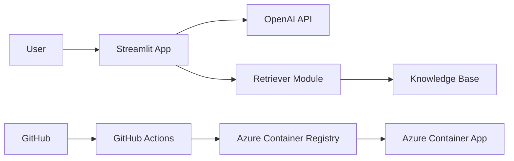

# Azure AI Knowledge Assistant 

Ein AI‑gestützter Azure Architecture Advisor zur Unterstützung von Cloud
Engineers und DevOps‑Teams bei Architekturentscheidungen,
Deployment‑Guidance und Troubleshooting im Azure‑Umfeld.

Das Projekt kombiniert **Cloud Engineering**, **Containerisierung**,
**CI/CD‑Automatisierung** und **Retrieval Augmented Generation (RAG)**
zu einem praxisnahen Azure‑orientierten Engineering‑Tool.

------------------------------------------------------------------------

# 📸 Screenshots

## 🖥️ Chatbot UI (Startansicht)


Moderne, strukturierte Benutzeroberfläche mit Architektur‑Fokus.

------------------------------------------------------------------------

##  Architekturberatung -- Beispielantwort (Teil 1)


Strukturierte Antwort mit:

-   Workload Snapshot\
-   Empfohlene Architektur\
-   Service Map\
-   Trade‑offs

------------------------------------------------------------------------

##  Architekturberatung -- Skalierung, Kosten & Risiken (Teil 2)


Erweiterte Analyse mit:

-   Skalierungsstrategie\
-   Cost Drivers\
-   Risiken / Anti‑Patterns\
-   Troubleshooting Hinweise\
-   Next Questions

------------------------------------------------------------------------

##  Deployment auf Azure Container Apps


Containerisierte Anwendung erfolgreich auf Azure deployed.

Demonstriert:

-   Azure Container Apps
-   Azure Resource Management
-   Produktionsnahe Bereitstellung

------------------------------------------------------------------------

#  Projektüberblick

Der Azure AI Knowledge Assistant fungiert als interner
Cloud‑Engineering‑Assistent und unterstützt bei:

-   Azure Architekturentscheidungen
-   Security / Reliability / Cost Trade‑offs
-   Deployment‑Strategien
-   Troubleshooting typischer Azure‑Setups
-   Schnelleren Projektstarts im Azure‑Umfeld
-   Kontextbasierter Beratung über eine eigene Knowledge Base (RAG)

Das System kombiniert Large Language Models mit kuratiertem Cloud‑Wissen
zur fundierten Entscheidungsunterstützung.

------------------------------------------------------------------------

#  Architektur & technische Highlights

-   Python‑basierte Chatbot‑Applikation (Streamlit)
-   Container‑ready Architektur (Docker)
-   Deployment auf Azure Container Apps
-   Integration mit Azure Container Registry (ACR)
-   GitHub Actions CI/CD Pipeline
-   Retrieval Augmented Generation (RAG) über lokale Knowledge Base
-   Modularer Retriever (`retriever.py`)
-   Trennung von Code, Prompts und Knowledge Base
-   Environment‑basierte Konfiguration

------------------------------------------------------------------------

#  Architekturdiagramm



------------------------------------------------------------------------

#  Tech Stack

## Core Technologien

-   Python
-   Streamlit
-   OpenAI API
-   Dotenv Environment Management
-   Retrieval Augmented Generation (RAG)

## Cloud & DevOps Fokus

-   Docker Containerisierung
-   Azure Container Registry (ACR)
-   Azure Container Apps
-   GitHub Actions CI/CD
-   Environment Secret Handling
-   Cloud Deployment Workflows

------------------------------------------------------------------------

#  Features

##  AI Cloud Advisor

-   Architektur‑Empfehlungen für Azure Workloads
-   Security / Reliability / Cost Trade‑offs
-   Deployment Guidance
-   Best Practice Empfehlungen

##  Knowledge Base Integration

-   Kontextbasierte Antwortgenerierung
-   Erweiterbare `/kb` Struktur
-   Autoritativer Kontext im System Prompt
-   Modularer Retrieval‑Ansatz

##  DevOps‑orientiertes Design

-   Container‑first Ansatz
-   Reproduzierbare Builds
-   CI/CD Deployment Pipeline
-   Azure‑native Deployment Workflow

------------------------------------------------------------------------

#  Repository Struktur

    .
    ├── app.py
    ├── retriever.py
    ├── kb/
    ├── prompts/
    ├── Dockerfile
    ├── requirements.txt
    ├── .github/workflows/
    └── screenshots/

------------------------------------------------------------------------

#  Lokale Nutzung

##  Dependencies installieren

``` bash
pip install -r requirements.txt
```

##  Environment konfigurieren

`.env` Datei erstellen:

    OPENAI_API_KEY=your_api_key
    OPENAI_MODEL=gpt-4o-mini

##  Anwendung starten

``` bash
streamlit run app.py
```

------------------------------------------------------------------------

#  Container Deployment

## Image bauen

``` bash
docker build -t azure-ai-assistant .
```

## Container starten

``` bash
docker run -p 8501:8501 --env-file .env azure-ai-assistant
```

------------------------------------------------------------------------

#  CI/CD Workflow (Azure Fokus)

Deployment Ablauf:

1.  Push ins GitHub Repository
2.  GitHub Actions startet Build
3.  Docker Image wird erzeugt
4.  Push in Azure Container Registry (ACR)
5.  Deployment auf Azure Container Apps

Demonstrierte Kompetenzen:

-   Container Lifecycle Management
-   Registry Integration
-   Cloud Deployment Automatisierung
-   Secret Handling über Environment Variablen
-   DevOps Best Practices

------------------------------------------------------------------------

#  Weiterentwicklung

-   Azure OpenAI Integration
-   Authentication / RBAC
-   Monitoring & Observability (Application Insights)
-   Infrastructure as Code (Terraform / Bicep)
-   Erweiterte Retrieval‑Strategien (Embeddings)

------------------------------------------------------------------------

#  Engineering Fokus

Dieses Projekt demonstriert:

-   Cloud Architecture Thinking
-   Azure Deployment Workflows
-   Containerisierung & DevOps
-   AI‑gestützte Engineering‑Prozesse
-   Strukturierte Projektorganisation
-   Produktionsnahe Cloud‑Anwendung
