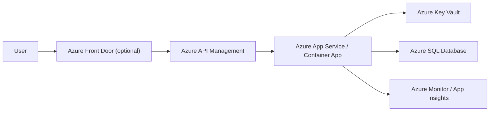

# Azure AI Knowledge Assistant

Ein AI-gestützter Azure Architecture Advisor zur Unterstützung von Cloud
Engineers und DevOps-Teams bei Architekturentscheidungen,
Deployment-Guidance und Troubleshooting im Azure-Umfeld.

Das Projekt demonstriert praktische Erfahrung in Cloud Engineering,
DevOps-Workflows, Containerisierung, Retrieval-Augmented Generation
(RAG) sowie automatisierter Generierung visueller Architekturdiagramme
mit Fokus auf Azure.

------------------------------------------------------------------------

## Projektüberblick

Der Azure AI Knowledge Assistant fungiert als interner
Cloud-Engineering-Assistent und unterstützt bei:

-   Azure Architekturentscheidungen\
-   Deployment-Planung und Best Practices\
-   Troubleshooting von Cloud-Setups\
-   Schnelleren Projektstarts im Azure-Umfeld\
-   Kontextbasierter Beratung über eine Knowledge Base (RAG)\
-   Automatischer Generierung visueller Architekturdiagramme (Mermaid)

Neben textuellen Empfehlungen erzeugt der Assistant automatisch
Architekturdiagramme, die direkt im Interface visualisiert werden.

------------------------------------------------------------------------

## Architekturdiagramm

Dieses Diagramm zeigt eine typische Zielarchitektur für eine interne
Bereitstellung mit Security-, Monitoring- und Governance-Komponenten.

------------------------------------------------------------------------

## Visuelle Architektur-Ausgabe

Ein zentrales Feature des Projekts ist die automatische Generierung von
Architekturdiagrammen auf Basis der jeweiligen Anforderungen.

Die Diagramme werden dynamisch als Mermaid-Flowcharts erstellt und
direkt im UI dargestellt.

### Beispiel: Interne Bereitstellung mit Entra ID und Monitoring

------------------------------------------------------------------------

## Architektur und technische Highlights

-   Python-basierte Chatbot-Applikation\
-   Streamlit UI\
-   Container-ready Architektur (Docker)\
-   Azure Deployment vorbereitet (Container Apps / Web App / ACR
    Workflow)\
-   Retrieval Augmented Generation über lokale Knowledge Base\
-   Dynamische Mermaid-Diagramm-Generierung\
-   Prompt-Separation zur Wartbarkeit (`/prompts`)\
-   Modularer Retriever (`retriever.py`)\
-   GitHub-basierte CI/CD Integration

------------------------------------------------------------------------

## Tech Stack

### Core Technologien

-   Python\
-   Streamlit\
-   OpenAI API\
-   Mermaid Diagram Rendering\
-   Knowledge Base Retrieval (RAG)

### Cloud / DevOps Fokus

-   Docker Containerisierung\
-   Azure Container Registry (ACR)\
-   GitHub Actions CI/CD Pipeline\
-   Azure Container Apps\
-   Azure Monitoring Stack

------------------------------------------------------------------------

## Repository Struktur

    .
    ├── app.py
    ├── retriever.py
    ├── kb/
    ├── prompts/
    ├── Dockerfile
    ├── requirements.txt
    └── .github/workflows

------------------------------------------------------------------------

## Weitere Screenshots

### UI Übersicht

### Azure Container App Deployment

------------------------------------------------------------------------

## Technischer Mehrwert

Dieses Projekt demonstriert:

-   Architekturdenken im Azure-Kontext\
-   Integration von AI in Cloud-Engineering-Workflows\
-   Automatisierte Diagramm-Erstellung mittels LLM\
-   Containerisierung und Deploymentprozesse\
-   CI/CD-Integration mit GitHub Actions\
-   Strukturierte technische Dokumentation
